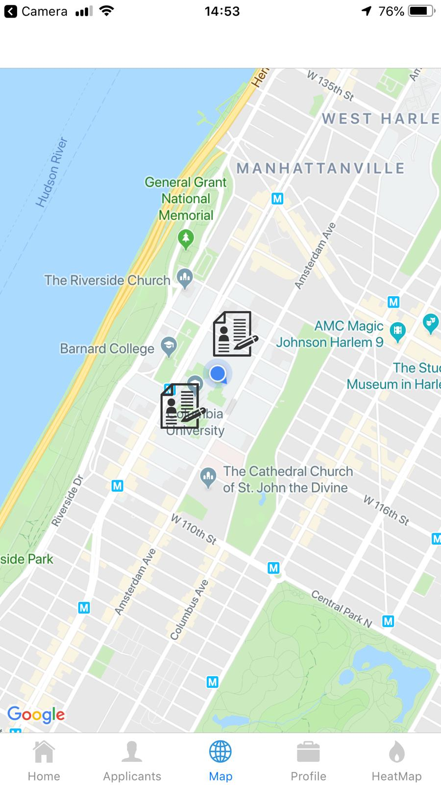
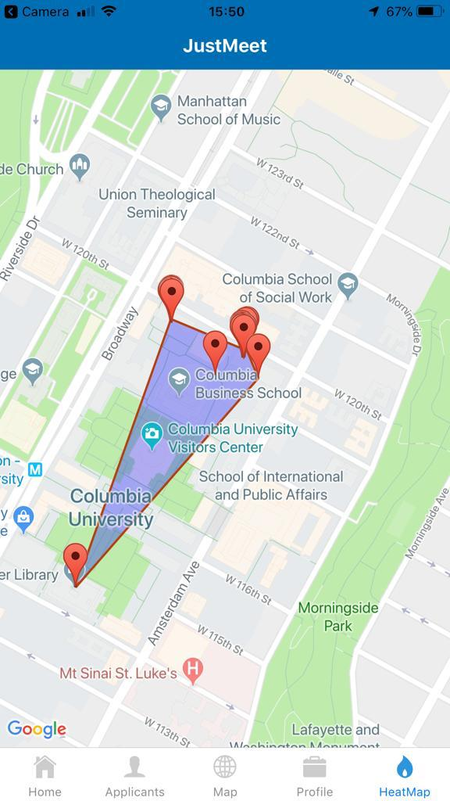

# JustMeet
JustMeet is a mobile application that facilitates in-person interactions between employers and job-seekers. We use the built-in smartphone GPS modules to access users' locations and push notifications to them regarding other users, based on interest and proximity. JustMeet provides a user friendly application that runs on IOS and Android, built with React Native. Applicants can view/update their profiles from within the app. Employers can view nearby applicants and request an in-person meeting. An intuitive map interface displays nearby applicants.

## Demo




# Table of Contents
[**Demo**](#Demo-/-TLDR)

[**Repository Strucure**](#Repository-Structure)

[**Results**](#Results)

[**Built With**](#Built-With)

[**Authors**](#Authors)

[**License**](#License)

[**Acknowledgments**](#Acknowledgments)

## Repository Structure
Below is a summary of the directory structure of this repository. The entirety of the React Native code is found within the 'JustMeet/' directory. There you will find a more detailed description of the code therein. 

```bash
├── JustMeet
│   ├── App.js
│   ├── __tests__/
│   ├── amplify/
│   ├── app.json
│   ├── assets/
│   ├── aws-exports.js
│   ├── babel.config.js
│   ├── components/
│   ├── constants/
│   ├── navigation/
│   ├── node_modules/
│   ├── package-lock.json
│   ├── package.json
│   ├── rn-cli.config.js
│   └── screens/
│   └── src/
├── ims/
├── PeriodicLambda.py
├── README.md
├── LICENSE
```

# Built With
* [React Native](https://facebook.github.io/react-native/) - JavaScript Library for developing mobile applications
* [AWS Amplify](https://aws-amplify.github.io) - Library to incorporate serverless AWS backend with a React Native application
* [AWS Cognito](https://aws.amazon.com/cognito/) - User authentication and management
* [AWS DynamoDB](https://aws.amazon.com/dynamodb/) - Flexible NoSQL Database service
* [AWS Lambda](https://aws.amazon.com/lambda/) - Serverless, scalable, on-demand compute
* [AWS SNS](https://aws.amazon.com/sns/) - Publisher-subscriber messenging service
* [Google Maps API](https://developers.google.com/maps/documentation/) - Interactive map for React Native

# Authors
* **Brian Midei** - [bmmidei](https://github.com/bmmidei)
* **Ariel Cohen-Codar** - [ac4391](https://github.com/ac4391)
* **Marko Mandic** - [markomandic](https://github.com/markomandic)

# License
This project is licensed under the MIT License - see the [LICENSE](LICENSE) file for details

# Acknowledgments
* We thank Antoine Crouillebois for helping our design choices within the application. 
